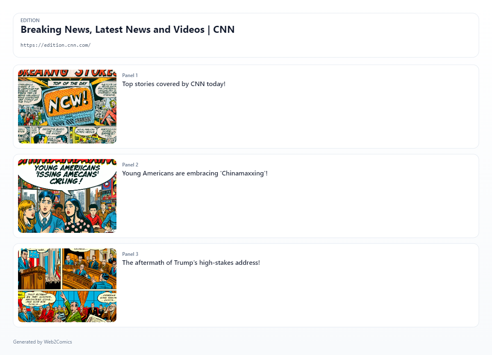
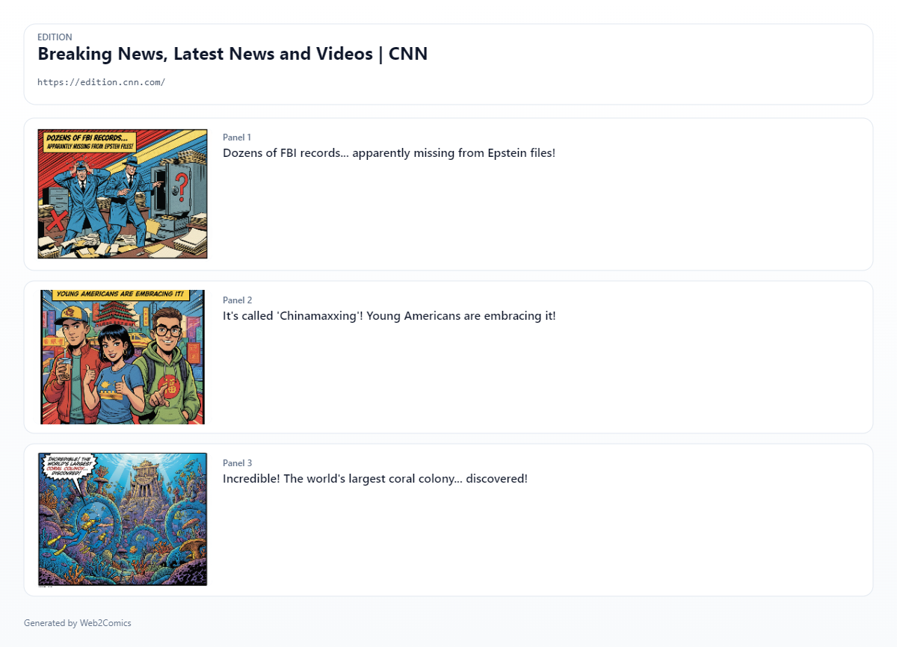
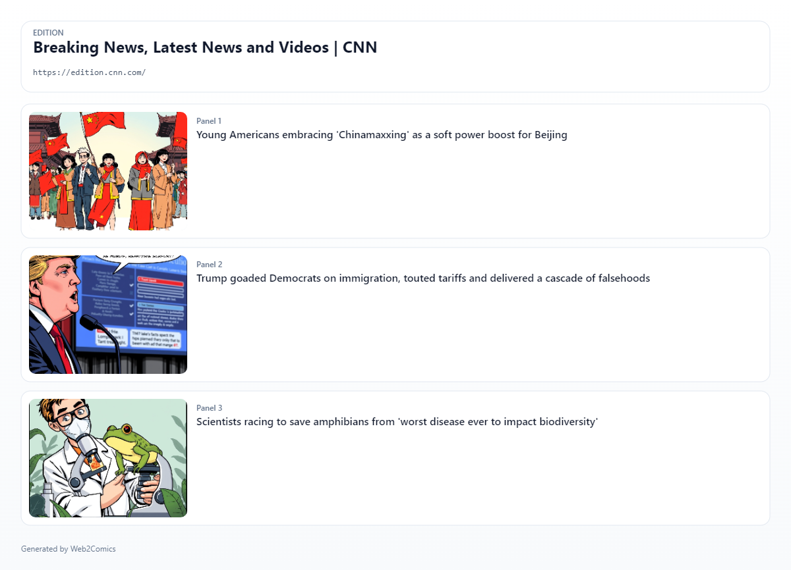

# Web2Comics

Turn any web page into a comic-strip summary using AI text + image models.

Web2Comics is a Chrome extension that:
- extracts content from the current page
- generates a storyboard (panels + captions)
- generates panel images
- shows the result in a comic viewer side panel
- saves history and exports a single composite comic image

## Install (Easy ZIP Method)

### Option A: Download Release ZIP (recommended for non-developers)

1. Open the repository `Releases` page on GitHub.
2. Download the latest release asset ZIP (for example `Web2Comics-v1.0-extension.zip`).
3. Extract the ZIP to a folder (for example `C:\Web2Comics`).
4. Open Chrome and go to `chrome://extensions`.
5. Turn on `Developer mode` (top-right).
6. Click `Load unpacked`.
7. Select the extracted folder that contains `manifest.json` (for example `Web2Comics-v1.0`).
8. Web2Comics will open the Options page on first install so you can configure providers.
9. (Optional) Pin the extension from Chrome’s extensions menu (Chrome does not allow extensions to pin themselves automatically).

Note: `Code -> Download ZIP` downloads the full source repository (tests/scripts/docs included). Use the release asset ZIP for installation.

### Option B: Clone the repo (developer workflow)

```powershell
git clone <your-repo-url>
cd Web2Comics
```

Then load it in Chrome using the same `chrome://extensions` -> `Load unpacked` steps above.

## What You Can Do

- Generate comics from articles, docs, blog posts, and reference pages
- Choose providers/models for text and image generation
- Use preset or custom visual styles
- Track live progress (elapsed time + ETA)
- Review history of generated comics
- Export a single PNG comic sheet with captions and source URL

## Supported Providers

Text + image support (current implementation):
- OpenAI
- Google Gemini
- Cloudflare Workers AI
- OpenRouter (model/account dependent)
- Hugging Face Inference API

Web2Comics also supports automatic fallback to other configured providers when a selected provider fails due to quota/budget issues.

## Example Use Cases

1. News article -> quick comic summary
- Open `cnn.com` (or another news site)
- Click the Web2Comics extension icon
- Click `Create Comic`
- Select a style and provider
- Generate a short comic summary of the article

2. Technical docs -> visual walkthrough
- Open docs (MDN, Python docs, Node docs)
- Generate a 3-panel comic to explain the page
- Use `Download` to save and share the comic image

3. Compare providers
- Configure multiple providers in `Options`
- Test different model combinations
- Use model test buttons in `Options -> Providers`

## Sample Comics (Real Provider Runs)

These examples were generated from the same `cnn.com` page using different providers and exported from Web2Comics as single PNG comic sheets.

### OpenAI



### Gemini



### Cloudflare Workers AI



## First-Time Setup (Recommended Free-Tier Start)

Web2Comics defaults are set for first-run success on free tiers:
- Provider: `Google Gemini` (text + image)
- Panel count: `3`
- Detail level: `low`

Why: this reduces token/image usage and improves chances of success on free-tier limits.

If Gemini free tier is unavailable for your account/region, configure another provider (Cloudflare, OpenRouter, Hugging Face, OpenAI). Web2Comics can fall back automatically to other configured providers on quota/budget failures.

## Provider Keys / Tokens

Configure providers in:
- `Options -> Providers`

The extension includes:
- `Validate` buttons for each provider
- `Test Text Model` / `Test Image Model` buttons (where supported)

For step-by-step key/token instructions, see:
- `docs/user-manual.html` (appendix)

## How To Use

1. Open a web page.
2. Click the Web2Comics extension icon.
3. Click `Create Comic`.
4. Choose provider/style (advanced settings optional).
5. If no providers are configured yet, use `Configure Model Providers` in the popup (or the Options page opened on install), then return and click `Generate`.
6. Watch live progress in popup/sidepanel.
7. Review the comic in the side panel.
8. Click `Download` to export a single comic sheet PNG.

## Project Structure (Quick Overview)

- `background/` - service worker, provider orchestration, generation pipeline
- `content/` - page content extraction script
- `popup/` - extension popup UI (launcher + generator wizard + progress)
- `options/` - settings UI (providers, prompts, storage, tests)
- `sidepanel/` - comic viewer, history browser, export
- `docs/` - user manual and docs
- `tests/` - unit/integration/E2E tests
- `scripts/` - probing/testing helper scripts

See per-folder `README.md` files for more detail.

## Local Development

Install dependencies:

```powershell
npm install
```

Useful commands:

```powershell
npm test
npx vitest run
npx playwright test
npm run probe:providers:extension
```

## Real Provider E2E Testing (Optional)

Local secrets can be stored in:
- `.env.e2e.local` (git-ignored)

Examples:

```env
OPENAI_API_KEY=...
GEMINI_API_KEY=...
CLOUDFLARE_ACCOUNT_ID=...
CLOUDFLARE_API_TOKEN=...
OPENROUTER_API_KEY=...
HUGGINGFACE_INFERENCE_API_TOKEN=...
```

## Troubleshooting

- Provider not visible in popup:
  - Configure credentials in `Options -> Providers`
  - Click `Validate`
- OpenAI key validates but model test fails:
  - The key may belong to a different OpenAI project or have different model access/billing
  - Re-paste the key and use `Test Text Model` / `Test Image Model`
- Gemini free tier says quota/limit `0`:
  - Check AI Studio project eligibility/region and active limits
- Generation fails on one provider:
  - Configure multiple providers so automatic budget fallback can recover
- Progress errors:
  - Enable `Debug flag` in `Options -> General`
  - Export logs from `Options -> Storage`

## Documentation

- User manual: `docs/user-manual.html`
- Additional specs: `SPEC.md`, `INSTALL.md`
