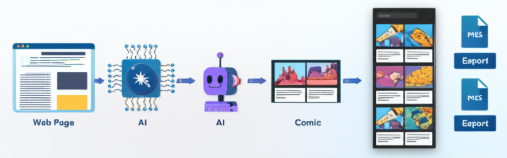
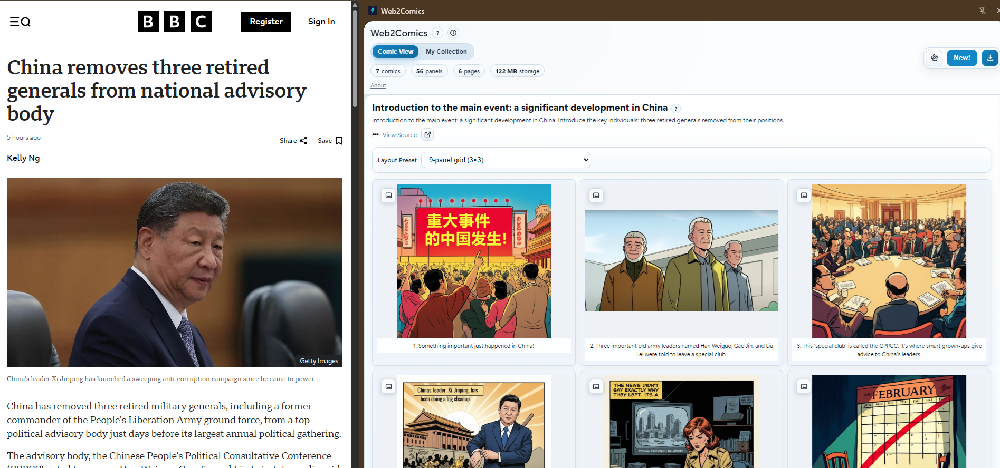

# Web2Comics: AI-Powered Chrome Extension That Turns Any Web Page Into a Comic-Strip Summary


<p align="center">
  
</p>

Web2Comics is a Chrome extension that:
- extracts content from the current page
- generates a storyboard (panels + captions)
- generates panel images
- shows the result in a comic viewer side panel
- saves history and exports a single composite comic image
- supports right-click selected-text flows (instant generate or open composer prefilled)

## Install (Release ZIP)

Release links:
- [Releases page](https://github.com/ApartsinProjects/Web2Comics/releases)
- [Current release (`v1.0.3`) ZIP](https://github.com/ApartsinProjects/Web2Comics/releases/download/v1.0.3/Web2Comics-v1.0.3-extension.zip)

1. Open the repository `Releases` page on GitHub (link above).
2. Download the latest release asset ZIP (for example `Web2Comics-v1.0.3-extension.zip`).
3. Extract the ZIP to a folder (for example `C:\Web2Comics`).
4. Open Chrome and go to `chrome://extensions`.
5. Turn on `Developer mode` (top-right).
6. Click `Load unpacked`.
7. Select the extracted folder that contains `manifest.json` (for example `Web2Comics-v1.0.3`).
8. In `chrome://extensions`, confirm the `Web2Comics` card is enabled (toggle ON).
9. Open the Chrome Extensions menu (puzzle icon), find `Web2Comics`, and click the pin icon to show it in the toolbar.
10. Open the extension and configure a [`Google Gemini` API key (free tier)](docs/Gemini_key.md) in `Options -> Providers` (recommended first-run setup).
11. Open any article, click `Create Comic`, and generate a 3-panel summary.

Note: `Code -> Download ZIP` downloads the full source repository. Use the release asset ZIP for installation.

## What You Can Do

- Generate comics from articles, docs, blog posts, and reference pages
- Choose providers/models for text and image generation
- Use preset or custom visual styles
- Track live progress (elapsed time + ETA)
- Review history of generated comics
- Export a single PNG comic sheet with captions and source URL
- Share to Facebook, X, LinkedIn, WhatsApp, Telegram, Reddit, or Email (plus copy-link/caption flows)

## Supported Providers

Current provider support:
- OpenAI
- Google Gemini
- Cloudflare Workers AI (text + image)
- OpenRouter (model/account dependent)
- Hugging Face Inference API

Web2Comics also supports automatic fallback to other configured providers when a selected provider fails due to quota/budget issues.

## Example Use Cases

1. News article -> quick comic summary
- Open `cnn.com` (or another news site)
- Click the Web2Comics extension icon
- Click `Create Comic`
- Select a style and provider
- Generate a short comic summary of the article

2. Technical docs -> visual walkthrough
- Open docs (MDN, Python docs, Node docs)
- Generate a 3-panel comic to explain the page
- Use `Download` to save and share the comic image

3. Compare providers
- Configure multiple providers in `Options`
- Test different model combinations
- Use model test buttons in `Options -> Providers`

## Example

<p align="center">
  
</p>

## First-Time Setup (Recommended Free-Tier Start)

Web2Comics defaults are set for first-run success on free tiers:
- Provider: `Google Gemini` (text + image)
- Panel count: `3`
- Detail level: `low`

Why: this reduces token/image usage and improves chances of success on free-tier limits.

If Gemini free tier is unavailable for your account/region, configure another provider (Cloudflare, OpenRouter, Hugging Face, OpenAI). Web2Comics can fall back automatically to other configured providers on quota/budget failures.

Need a Gemini key for the free tier? See `docs/Gemini_key.md`.

## Provider Keys / Tokens

Configure providers in:
- `Options -> Providers`

The extension includes:
- `Validate` buttons for each provider
- `Test Text Model` / `Test Image Model` buttons (where supported)

For step-by-step key/token instructions, see:
- `docs/user-manual.html` (appendix)
- `docs/Gemini_key.md` (quick Gemini API key setup for free tier access)

## Requirements / Compatibility

- Chrome / Chromium-based browser with Manifest V3 extension support
- Chrome Side Panel support (used for the comic viewer)
- Internet access to your selected AI provider APIs
- At least one configured provider credential (`Options -> Providers`)

## Privacy / Data Handling

- Web2Comics runs locally in your browser extension (no project-hosted backend server).
- To generate comics, the extension sends extracted page text, prompts, and generation requests to the AI provider(s) you configure.
- API keys/tokens are stored in your browser extension storage on your machine.
- Generated comics/history are stored locally unless you export/share them.
- Review provider terms/privacy policies (OpenAI, Google Gemini, Cloudflare, OpenRouter, Hugging Face) before use on sensitive content.

## How To Use

1. Open a web page.
2. Click the Web2Comics extension icon.
3. Click `Create Comic`.
4. Choose provider/style (advanced settings optional).
5. If no providers are configured yet, use `Configure Model Providers` in the popup (or the Options page opened on install), then return and click `Generate`.
6. Watch live progress in popup/sidepanel.
7. Review the comic in the side panel.
8. Click `Download` to export a single comic sheet PNG.

Optional selected-text right-click flow:
1. Highlight text on any page.
2. Right-click.
3. Choose `Generate comic from selected text (Default)` for instant generation, or `Open Create Comic with selected text` to review/customize before generating.

## Project Structure (Quick Overview)

- `background/` - service worker, provider orchestration, generation pipeline
- `content/` - page content extraction script
- `popup/` - extension popup UI (launcher + generator wizard + progress)
- `options/` - settings UI (providers, prompts, storage, tests)
- `sidepanel/` - comic viewer, history browser, export
- `docs/` - user manual and docs
- `tests/` - unit/integration/E2E tests
- `scripts/` - probing/testing helper scripts

See per-folder `README.md` files for more detail.

## Local Development

Install dependencies:

```powershell
npm install
```

Useful commands:

```powershell
npm test
npx vitest run
npx playwright test
npm run probe:providers:extension
```

## Real Provider E2E Testing (Optional)

Local secrets can be stored in:
- `.env.e2e.local` (git-ignored)

Examples:

```env
OPENAI_API_KEY=...
GEMINI_API_KEY=...
CLOUDFLARE_ACCOUNT_ID=...
CLOUDFLARE_API_TOKEN=...
OPENROUTER_API_KEY=...
HUGGINGFACE_INFERENCE_API_TOKEN=...
```

## Troubleshooting

- Extension icon not visible in toolbar:
  - Open the Chrome Extensions (puzzle) menu and pin `Web2Comics`
  - Confirm the extension is enabled in `chrome://extensions`
- Provider not visible in popup:
  - Configure credentials in `Options -> Providers`
  - Click `Validate`
- OpenAI key validates but model test fails:
  - The key may belong to a different OpenAI project or have different model access/billing
  - Re-paste the key and use `Test Text Model` / `Test Image Model`
- Gemini free tier says quota/limit `0`:
  - Check AI Studio project eligibility/region and active limits
- Generation fails on one provider:
  - Configure multiple providers so automatic budget fallback can recover
- Progress errors:
  - Enable `Debug flag` in `Options -> General`
  - Export logs from `Options -> Storage`

## Documentation

- User manual: `docs/user-manual.html`
- Additional specs: `docs/initial_specs.md`, `INSTALL.md`
